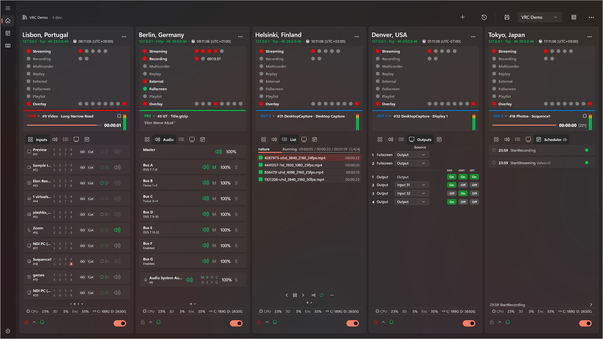

[En](README.md) | [Ru](README-ru.md)

# VRC (Video Recording Control Hub)
### Быстрые ссылки

* 📥 **[Скачать последнюю версию](https://github.com/Kotin-ak/VRC-Releases/releases)**
* 🐛 [Сообщить о баге / проблеме](https://github.com/Kotin-ak/VRC-Releases/issues)

**VRC — это централизованное Windows-приложение, разработанное для удаленного МОНИТОРИНГА и УПРАВЛЕНИЯ несколькими экземплярами vMix с единого дашборда.** Хватит прыгать между разными компьютерами для управления трансляцией. С VRC у вас есть полное удаленное управление вашими нодами vMix:

* 🔴 **Полное удаленное управление:** Запускайте, останавливайте и управляйте записью (Recording), трансляцией (Streaming), внешними выходами (External) и мультикамерой (Multicorder) одним кликом или с помощью настраиваемых сочетаний клавиш (идеально для Elgato Stream Deck).
* 📊 **Глубокий мониторинг:** Отслеживайте производительность CPU/GPU и мониторьте доступное место на диске в реальном времени через WMI для предотвращения сбоев записи.
* ⏰ **Умная автоматизация:** Встроенный планировщик задач для автоматизации команд vMix на основе точного времени.

*(Примечание: Хотя архитектура разработана как "Хаб", текущий релиз сильно оптимизирован для глубокой и стабильной интеграции исключительно с **vMix**).*

---
## Почему VRC? (Какую проблему он решает)

В профессиональном прямом эфире редко полагаются на одну машину. У вас может быть один ПК с vMix для основного микса, второй для мгновенных повторов и третий для графики или кодирования. Одновременный мониторинг и управление всеми ими обычно требует большой команды или постоянного переключения между KVM, что приводит к пропущенным моментам, высокому уровню стресса и возможным сбоям в эфире.

VRC был создан для решения именно этой проблемы. Он превращает любой Windows-планшет или ноутбук в вашей сети в **Главную аппаратную (Master Control Room)**.

### Для кого это?
* **Одиночных операторов и небольших команд:** Управляйте записью, трансляцией и переключением на нескольких ПК без дополнительных рабочих рук. Идеально для местного спорта, корпоративных мероприятий и живых концертов.
* **Киберспортивных трансляций:** Управляйте сложными многоузловыми сетапами (POV игроков, столы комментаторов, основной фид) из одного центрального хаба с точным таймингом.
* **Бродкаст-инженеров и технических директоров:** Мониторьте загрузку CPU и GPU, уровни звука и, что критично, **отслеживайте оставшееся свободное место на диске** на всех нодах в реальном времени. Предотвращайте падения стрима и испорченные записи до того, как они произойдут.

---

## 🛠 Установка (Важно!)

> [!IMPORTANT]
> Поскольку VRC является локально подписанным пакетом .msix, вам **Необходимо** сначала установить сертификат безопасности, иначе Windows заблокирует установку.

1. Скачайте архив `.zip` со страницы Releases и распакуйте его.
2. 2. **Установите сертификат безопасности:** Щелкните правой кнопкой мыши по файлу сертификата, выберите «Установить» (Install) и поместите его в **"Локальный компьютер" (Local Machine) -> "Доверенные лица" (Trusted People)**.
3. **Установите зависимости:** Распакованная папка содержит каталог `Dependencies` с дополнительными необходимыми ресурсами. Поскольку это 64-битный пакет Windows, перейдите в `Dependencies\x64` и установите Windows App Runtime, дважды щелкнув: `Microsoft.WindowsAppRuntime.2.0-preview1.msix`
4. **Установите VRC:** Наконец, дважды щелкните основной файл VRC `.msix`, чтобы установить приложение.

### Быстрые ссылки

* 📥 **[Скачать последнюю версию](https://github.com/Kotin-ak/VRC-Releases/releases)**
* 🐛 [Сообщить о баге / проблеме](https://github.com/Kotin-ak/VRC-Releases/issues)

---

## 1. Дашборд

Главный экран приложения — сетка карточек подключенных устройств с мониторингом в реальном времени.

---

### Панель команд (Управление рабочей областью)

**Что такое Пресеты и Конфигурации?**
* **Пресет (Preset):** Сохраненная группа машин vMix (ваша конкретная рабочая область). Если вы перемещаетесь между разными площадками, вы можете сохранить пресет для "Студии А" и другой для "Выездного турнира". Загрузите пресет, и VRC мгновенно подключится к нужным нодам vMix для этой локации, не требуя повторного ввода IP-адресов вручную.
* **Конфигурация (Configuration):** Мастер-резервная копия вашего приложения VRC, включающая *все* ваши пресеты и глобальные настройки. Используйте это для быстрого клонирования всей вашей настройки VRC на дополнительный или резервный ноутбук управления.

| Действие | Сочетание клавиш | Бизнес-ценность / Описание |
|--------|----------|------------------------------|
| **Add vMix** | `Ctrl+N` | Подключить новую ноду vMix к текущей рабочей области |
| **Last Session** | — | Быстро восстановить те машины, которые вы мониторили при последнем закрытии VRC |
| **Save Preset** | `Ctrl+S` | Сохранить текущую сетку машин vMix для мгновенной загрузки в следующий раз |
| **Card Size** | — | Настроить, сколько места на экране занимает каждая карточка устройства |

Строка состояния отображает имя текущего пресета и количество подключенных устройств.

#### Дополнительные команды (меню переполнения "⋯")

| Действие | Сочетание клавиш | Бизнес-ценность / Описание |
|--------|----------|------------------------------|
| **Save As…** | `Ctrl+Shift+S` | Дублировать текущую рабочую область под новым именем (например, "Турнир День 2") |
| **Delete Preset** | — | Удалить настройку рабочей области, которая больше не нужна |
| **Export Preset** | — | Сохранить конкретный макет рабочей области в файл, чтобы поделиться с другим оператором |
| **Import Preset** | — | Загрузить макет рабочей области, предоставленный кем-то другим |
| **Export Configuration** | — | Создать мастер-резервную копию всей настройки VRC для легкого переноса на другой ПК |
| **Import Configuration** | — | Восстановить вашу мастер-резервную копию на новом ноутбуке управления |

### Отображение карточек

- Карточки устройств расположены в адаптивной сетке, которая автоматически подстраивается под размер окна.
- **Пагинация** — когда устройств много, карточки разбиваются на страницы с точечным индикатором для навигации. Поддерживается прокрутка колесиком мыши.

---

## 2. Управление устройствами vMix

### Добавление устройства

При добавлении нового устройства vMix указываются следующие поля:

- **Name** — пользовательское имя (до 20 символов).
- **IP Address** — адрес машины, на которой запущен vMix.
- **HTTP Port** — порт Web API vMix.
- **TCP Port** — порт TCP API (настраивается автоматически).
- **Polling Interval** — частота обновления данных (250–5000 мс).
- **Login and Password** — учетные данные для авторизации (если требуется).
- **Transport Mode** — метод связи с vMix (HTTP, TCP и т.д.). При выборе HTTP отображается предупреждение об ограничениях.
- **Time Zone** — назначение часового пояса для устройства, чтобы обеспечить правильное отображение времени при удаленной работе.

### Проверка подключения (Probe)

Перед сохранением вы можете протестировать подключение к устройству. Результат и детали отображаются прямо в диалоговом окне.

### Параметры подключения

- **Auto-Connect** — автоматическое подключение к устройству при запуске приложения.
- **Auto-Reconnect** — автоматическое восстановление соединения при его потере.

### Действия с устройством

Доступны через контекстное меню карточки:

- **Streaming Settings** — открыть диалог управления каналами трансляции.
- **Edit** — изменить параметры подключения.
- **WMI Settings** — настроить удаленный мониторинг ПК.
- **Logs** — просмотреть журнал событий устройства.
- **Delete** — удалить устройство из конфигурации.
- **Move to…** — переместить устройство между группами.

---

## 3. Карточка устройства

Каждое подключенное устройство vMix отображается в виде карточки с полной информацией в реальном времени. 

> [!NOTE]
> **Безопасность прежде всего:** По умолчанию все действия по управлению на карточке **ЗАБЛОКИРОВАНЫ** для предотвращения случайных кликов во время прямого эфира. Чтобы включить управление, необходимо сначала нажать на значок **Замка (🔒)** в подвале карточки.

### 3.1. Шапка (Header)

- Имя устройства, IP-адрес, режим транспорта.
- Версия и редакция vMix, имя пресета.
- Часовой пояс устройства.
- Цветовой индикатор статуса подключения.
- **Контекстное меню (⋯)** — настройки трансляции, редактирование, WMI, журналы, удаление, перемещение между группами.

### 3.2. Индикаторы статуса

Интерактивные индикаторы — клик переключает соответствующую функцию vMix:

| Индикатор | Клик | Детали |
|-----------|-------|---------|
| **Streaming** | Старт/стоп всех каналов | Индивидуальные индикаторы каналов 1–5 (каждый кликабелен). Количество каналов зависит от редакции vMix |
| **Recording** | Старт/стоп записи | Индикаторы основного и вторичного рекордера, таймер продолжительности записи |
| **Multicorder** | Старт/стоп мультикамеры | Отображается только если поддерживается редакцией vMix |
| **Replay** | Старт/стоп записи Instant Replay | Отображается только если поддерживается редакцией vMix |
| **External** | Вкл/выкл внешний выход | Всплывающая подсказка с деталями конфигурации выхода |
| **Fullscreen** | Вкл/выкл полноэкранный режим | Всплывающая подсказка с текущими настройками |
| **Playlist** | Старт/стоп плейлиста | — |
| **Overlay** | Отключить все оверлеи | Индивидуальные индикаторы для каждого слоя (каждый кликабелен отдельно) |

### 3.3. Программный монитор (Program Monitor)

Раздел, отображающий текущий источник в Program/Preview с уровнями звука.

#### Выбор источника для монитора

Через выпадающее меню или прокруткой колесика мыши:

| Источник | Описание |
|--------|-------------|
| **Program** | Основной программный выход |
| **Preview** | Выход предварительного просмотра |
| **PRV\|PGM** | Автоматически — отображает активный источник |
| **Output 1–4** | Внешние выходы (Output 3–4 при поддержке) |
| **Overlay 1–8** | Слои оверлеев (Overlay 5–8 с расширенными оверлеями) |

#### Информационная панель

- **Current input name** — имя и метка воспроизводимого источника.
- **Progress bar** — для воспроизводимых источников (видео), показывает оставшееся время.
- **Playback status** — иконки Play / Pause / Stop.
- **Loop** — индикатор зацикливания.
- **List position** — отображение индекса элемента для видеосписков.
- **Title text** — текущий текст для входов титров.

#### Мастер-индикатор звука (Master Audio Meter)

- Двухканальный (L/R) вертикальный индикатор уровня шины Master.
- Градиент: зеленый (норма) → желтый (запас) → красный (клиппинг).
- Всплывающая подсказка с пиковыми значениями (dBFS).

### 3.4. Вкладка Inputs — Управление входами

Список всех входов vMix с пагинацией.

#### Доступно для каждого входа:

**Основные действия (кнопки):**

| Действие | Описание |
|--------|-------------|
| **GO / QuickPlay** | Переход на вход (GO для vMix v29+, QuickPlay для более ранних версий) |
| **Cut** | Мгновенное переключение на вход через Cut |
| **Play / Pause** | Воспроизведение / пауза (для видеовходов) |
| **Loop** | Вкл/выкл зацикливание воспроизведения |
| **Mute** | Отключить / включить звук входа |

**Оверлеи входов (сетка 4×2):**

- Переключение слоев оверлеев 1–8 индивидуально по клику.
- Контекстное меню оверлея для дополнительных действий.

**Контекстное меню входа (правый клик):**

| Действие | Описание |
|--------|-------------|
| **Active** | Отправить вход в Program |
| **Preview** | Отправить вход в Preview |
| **Restart** | Перезапустить воспроизведение (для видео) |
| **AutoPause** (On/Off) | Автопауза при переключении с этого входа |
| **AutoPlay** (On/Off) | Автовоспроизведение при переключении на этот вход |
| **AutoRestart** (On/Off) | Автоперезапуск по завершении |
| **Video Source** (1–4) | Выбор источника видео для входов Video Call |
| **Audio Source** | Выбор источника звука для Video Call: Master, Headphones, Шины A–G |

**Индикаторы:**

- Уровни звука (двухканальный измеритель L/R) для каждого входа.
- Цветная рамка: зеленая (Preview) / красная (Program).
- Иконка типа входа (камера, видео, титры и т.д.).

### 3.5. Вкладка Audio — Аудиомикшер

Полнофункциональный аудиомикшер с раздельным управлением мастер-шиной, шинами и входами.

#### Мастер-шина (Master Bus)

| Действие | Описание |
|--------|-------------|
| **Mute** | Отключить / включить Master |
| **Volume slider** | Регулировка уровня Master (0–100%) через всплывающий фейдер |
| **Audio meter** | Двухканальный индикатор уровня L/R |

#### Аудиошины (Bus A–G)

Для каждой доступной шины:

| Действие | Описание |
|--------|-------------|
| **Mute** | Отключить / включить шину |
| **Send to Master (M)** | Направить шину в мастер |
| **Volume slider** | Регулировка уровня шины (0–100%) |
| **Solo (S)** | Соло-прослушивание шины |
| **Audio meter** | Двухканальный индикатор уровня L/R |

#### Звук по входам (Per-Input Audio)

Для каждого входа со звуком:

| Действие | Описание |
|--------|-------------|
| **Mute** | Отключить / включить звук входа |
| **AFV** | Audio Follow Video — автоматическое управление звуком при переключении |
| **Routing (M, A–G)** | Назначение входа на шины: Master и Bus A–G (индивидуально, по клику) |
| **Volume slider** | Регулировка уровня входа (0–100%) через всплывающий фейдер |
| **Solo (S)** | Соло-прослушивание входа |
| **Audio meter** | Двухканальный индикатор уровня L/R |

### 3.6. Вкладка List — Управление видеосписками

Управление видеосписками (плейлистами) для vMix. Отображается при наличии видеосписков.

#### Информационная панель

- Текущее имя списка и его состояние (Воспроизводится / На паузе / Остановлен).
- Позиция / продолжительность / оставшееся время.
- Количество элементов в списке.
- Полоса прогресса воспроизведения.

#### Список элементов

- Отображение всех файлов в списке с их длительностью.
- Цветовая подсветка текущего воспроизводимого элемента.
- Индикатор включенного/отключенного элемента.
- **Контекстное меню**: Select, Remove (удалить из списка).

#### Элементы управления воспроизведением

| Кнопка | Описание |
|--------|-------------|
| **⏮ Previous** | Предыдущий элемент списка |
| **⏯ Play / Pause** | Воспроизведение / пауза |
| **⏭ Next** | Следующий элемент списка |
| **🔀 Shuffle** | Перемешать список |
| **🔁 Loop** | Зациклить список |

#### Дополнительные команды (меню переполнения "⋯")

| Команда | Описание |
|---------|-------------|
| **Play Out** | Воспроизведение с автоматическим завершением |
| **Auto Next** | Автопереход к следующему элементу |
| **Auto First** | Автовозврат к первому элементу |

#### Навигация по спискам

- Переключение между несколькими видеосписками с помощью точечного индикатора (PipsPager).

### 3.7. Вкладка Outputs — Управление выходами

Подробное отображение и управление выходами vMix.

#### Полноэкранные выходы (Fullscreen)

| Выход | Описание |
|--------|-------------|
| **Fullscreen 1** | Основной полноэкранный выход — выбор источника через SplitButton |
| **Fullscreen 2** | Вторичный полноэкранный выход (при наличии поддержки двух мониторов) |

#### Внешние выходы (Output 1–4)

Для каждого выхода отображается следующее:

- **Source** — текущий назначенный источник (можно изменить для Output 2–4).
- **NDI** — статус трансляции NDI (Вкл/Выкл).
- **OMT** — статус выхода OMT (Вкл/Выкл).
- **SRT** — статус трансляции SRT (кликабельно для переключения).

> Output 3 и Output 4 отображаются только для редакций vMix с четырьмя внешними выходами.

### 3.8. Вкладка Replay — Мгновенный повтор

Раздел для управления Instant Replay (реализация в процессе).

### 3.9. Вкладка Scheduler — Расписание устройства

Компактный список запланированных задач для данного устройства.

- Отображение предстоящих задач: время, функция, параметры, статус.
- Индикатор времени до следующей задачи.
- Кнопка **Open Scheduler** — переход на полную страницу планировщика.

### 3.10. Подвал карточки (Footer)

| Элемент | Описание |
|---------|-------------|
| **🔒 Lock** | Блокировка. Состояние по умолчанию: ВКЛ. Защищает от случайных действий. Когда активно, все кнопки управления заблокированы. Кликните для переключения. |
| **🔽 Collapse Audio** | Показать/скрыть раздел аудио (с анимацией вращения иконки) |
| **🔔 Notifications** | Включить/отключить уведомления для конкретного устройства (зеленый — вкл, серый — выкл) |
| **⚠ Errors** | Отображение текущих ошибок подключения (красным цветом) |
| **⏳ Spinner** | Индикатор загрузки во время выполнения операции |
| **🔘 Connection Toggle** | Включить/отключить подключение к устройству |

---

## 4. Мониторинг состояния ПК (PC Health, WMI)

Удаленный сбор метрик рабочей станции, на которой запущен vMix:
* CPU — загрузка процессора (с подсветкой критических значений).
* GPU 3D & Encode — загрузка видеокарты и аппаратного энкодера.
* Disks — мониторинг свободного места на дисках.

Данные собираются нативно через Windows Management Instrumentation (WMI).

#### 🛠 Удобная настройка WMI
Настройка WMI по сети обычно требует утомительной правки брандмауэра и UAC. Чтобы сделать это безболезненным, в меню настроек VRC предусмотрены встроенные скрипты PowerShell для автоматизации процесса:

1. Удаленный ПК (целевая машина с vMix): Нажмите Copy -> Remote PC в VRC и запустите скопированный скрипт в PowerShell (от имени администратора) на целевой машине. Это автоматически настроит разрешения WMI, брандмауэр Windows и UAC (LocalAccountTokenFilterPolicy) для удаленного доступа.
2. Этот ПК (хост VRC): Нажмите Copy -> This PC и запустите скрипт локально (от имени администратора), чтобы добавить удаленную машину в список TrustedHosts.
3. Учетные данные: Введите логин и пароль Windows удаленного ПК.
   * *Workgroup (Рабочая группа):* используйте только имя пользователя.
   * *Domain (Домен):* используйте DOMAIN\username или .\username для локального администратора.
4. Сетевые порты: Если вы выполняете мониторинг между разными подсетями, убедитесь, что ваши корпоративные маршрутизаторы разрешают трафик по порту TCP 135 и динамическому диапазону RPC (49152–65535).

---

## 5. Настройки трансляции (Streaming Settings)

Специальный диалог для управления каналами трансляции конкретного устройства:

- Индивидуальные переключатели (Start/Stop) для каждого канала.
- Отображение статуса подключения и версии vMix.
- Информация о редакции и IP-адресе.

---

## 6. Планировщик задач (Task Scheduler)

Централизованное управление отложенными и повторяющимися командами для всех устройств.

### Создание задачи

- **Name** — пользовательское имя задачи.
- **Device** — выбор целевого устройства.
- **Category and Function** — выбор команды из иерархического каталога.
- **Parameters** — дополнительные параметры команды (динамически зависят от выбранной функции).
- **Schedule** — тип: одноразовая / ежедневно / еженедельно.
- **Time and Date** — точный момент выполнения (24-часовой формат).
- **Retries** — количество попыток повторения при сбое (1–10).
- **Enable/Disable** — индивидуально для каждой задачи.

### Управление задачами

- **Глобальный переключатель** — включить/отключить весь планировщик.
- **Фильтрация** — по устройству и по статусу.
- **Вкладки**: все задачи, предстоящие (24 ч), ошибки.

### Массовые действия

| Действие | Описание |
|--------|-------------|
| **Hold** | Приостановить выбранные задачи |
| **Run Now** | Немедленно выполнить выбранные задачи |
| **+5 / +10 / +15 min** | Отложить выполнение на указанное время |
| **Cancel** | Отменить выбранные задачи |
| **Restore** | Восстановить отмененные задачи |

### Дополнительные детали

- Индикация отключенных устройств в списке задач.
- Предупреждающий баннер, когда планировщик отключен.
- Отображение результата последнего выполнения на панели деталей.

---

## 7. Сочетания клавиш (Интеграция с внешними контроллерами)

Привязка кнопок внешних контроллеров (Stream Deck, Companion, Touch Portal и т.д.) к командам устройств VRC. Вся настройка выполняется полностью внутри VRC — внешнее устройство действует как "тонкий клиент", который только сообщает о нажатиях кнопок.

> Этот подход повторяет модель vMix Shortcuts: на стороне контроллера не требуется никакой конфигурации.

### Как это работает

1. Пользователь перетаскивает действие "VRC Control" на кнопку Stream Deck — **готово**. Никаких дополнительных настроек на стороне контроллера не требуется.
2. Кнопка автоматически получает уникальный ID (UUID действия из SDK Stream Deck).
3. Плагин подключается к локальному Control API VRC (`localhost:5101`) через SignalR.
4. В VRC пользователь открывает **Shortcuts** и создает новый шорткат, нажимая **Add**.
5. Открывается диалог **Find Control** — пользователь нажимает физическую кнопку на контроллере.
6. VRC захватывает ID кнопки и создает `ShortcutEntry`, привязанный к этому ключу.
7. Пользователь настраивает команду: **Device → Category → Function → Parameters**.
8. При нажатии кнопки во время работы VRC находит шорткат по ключу и выполняет привязанную команду на целевом устройстве.

### Структура страницы

Макет Master-detail (аналогично странице Scheduler).

#### Панель команд

| Действие | Описание |
|--------|-------------|
| **Add** | Создать новый шорткат (открывает панель деталей в режиме создания) |

#### Мастер-панель (Слева — Список шорткатов)

- **Фильтр устройств** — фильтрация шорткатов по целевому устройству (ComboBox с опцией "All devices").
- Колонки таблицы: чекбокс (вкл/выкл), индикатор статуса, Key, Device, Function, Title.
- Выбор строки выделяет элемент и загружает его на панель деталей.
- Клик по пустой области снимает выделение с текущего шортката.
- **Стрелки изменения порядка** (▲ / ▼) — переместить выбранный шорткат вверх или вниз по списку.

#### Панель деталей (Справа — Редактор шорткатов)

Когда шорткат не выбран, отображается пустое состояние с предложением выбрать или создать шорткат.

Когда шорткат выбран или создается:

| Поле | Описание |
|-------|-------------|
| **Key** | Идентификатор внешней кнопки (только для чтения, устанавливается через Find Control) |
| **Find Control** | Открывает диалог обнаружения кнопки |
| **Title** | Понятное человеку имя для шортката |
| **Device** | Целевое устройство для выполнения команды |
| **Category** | Категория команды из иерархического каталога |
| **Function** | Конкретная функция в категории |
| **Parameters** | Динамические параметры, зависящие от выбранной функции |
| **Enabled** | Переключатель для включения/отключения шортката |

#### Настройки обратной связи (Feedback Settings)

Настраивает визуальную обратную связь, отправляемую обратно на кнопку внешнего контроллера.

| Поле | Описание |
|-------|-------------|
| **Event** | Тип события ACTS для обратной связи (например, Recording, Streaming, Input, Overlay и т.д.) |
| **Input Number** | Номер входа для событий, привязанных к входу (показывается только для соответствующих типов событий) |
| **Color** | Цвет обратной связи для кнопки, когда событие активно (8 предустановленных цветов с палитрой выбора) |

Доступные события обратной связи:

| Категория | События |
|----------|--------|
| **Global** | Recording, Streaming, External, Fullscreen, FadeToBlack, MasterAudio, звук шин Bus A–G |
| **Input-bound** | Input (Program), InputPreview, InputPlaying, InputAudio, InputSolo, InputLoop, маршрутизация входа на шины (A–G, Master), InputAudioAuto |
| **Overlays** | Overlay 1–8 |

#### Кнопки действий

| Кнопка | Описание |
|--------|-------------|
| **Save** | Сохранить конфигурацию шортката |
| **Cancel** | Отменить создание (видима только в режиме создания) |
| **Delete** | Удалить выбранный шорткат |

### Диалог Find Control (Обнаружение контроллера)

Модальное окно для обнаружения кнопок внешнего контроллера:

1. Отображает кольцо прогресса и подсказку: "Press a button on your controller…" (Нажмите кнопку на вашем контроллере...).
2. При получении нажатия кнопки через SignalR (`IdentifyButton`), диалог показывает захваченный ID кнопки.
3. Пользователь подтверждает нажатием OK — ключ назначается шорткату.

> Метод `IdentifyButton` отделен от `execute` — нажатие кнопки во время обнаружения **не** запускает привязанную команду.

### Процесс выполнения шортката (Shortcut Execution Flow)

1. Внешнее устройство отправляет `POST /api/shortcuts/execute { "buttonId": "uuid" }` на `localhost:5101`.
2. VRC: `ShortcutExecutor.ExecuteByKeyAsync(buttonId)` → `ShortcutStore.FindByKey` → проверка `IsEnabled` → `DeviceManager.GetDeviceById` → `DeviceClient.SendAsync(DeviceCommand)`.
3. Если настроена обратная связь, VRC отправляет текущее состояние обратно на контроллер через SignalR.

---

## 8. Настройки приложения

### Общие (General)

| Параметр | Описание |
|-----------|-------------|
| **Language** | Выбор языка интерфейса (Русский / Английский) |
| **Minimize to Tray** | Приложение сворачивается в системный трей вместо панели задач |
| **Auto-Start** | Автоматический запуск приложения при входе в Windows |
| **Multiple Instances** | Разрешить запуск нескольких копий приложения |

### Уведомления (Notifications)

| Параметр | Описание |
|-----------|-------------|
| **Notifications** | Включить/отключить Toast-уведомления Windows |
| **Mode** | All / Critical / Broadcast / Off |
| **Connection Notifications** | Оповещения о подключении/отключении устройства |
| **Silent Mode** | Подавить звуки уведомлений |

### Веб-дашборд (Web Dashboard)

| Параметр | Описание |
|-----------|-------------|
| **Enable** | Активировать встроенный веб-сервер |
| **Port** | Настройка порта (1–65535) |
| **Local URL** | Ссылка на дашборд для этого ПК |
| **LAN Addresses** | Список адресов для доступа по локальной сети |

### Журналы и диагностика (Logs and Diagnostics)

| Параметр | Описание |
|-----------|-------------|
| **Device Logs** | Открыть папку с журналами устройств |
| **GC Monitor** | Статус мониторинга сборщика мусора и логи |

### О программе (About)

| Параметр | Описание |
|-----------|-------------|
| **Version** | Текущая версия приложения |
| **Updates** | Проверить, скачать и установить обновления с отображением прогресса |
| **Release Notes** | Ссылка на страницу релизов |
| **Reset Settings** | Сбросить все настройки по умолчанию |

---

## 9. Веб-дашборд

Встроенный дашборд (только для чтения), доступный из любого браузера в локальной сети.

- **Обновления в реальном времени** через SignalR с автоматическим переподключением.
- Отображение всех подключенных устройств с индикаторами:
  - **REC** — запись.
  - **STREAM** — трансляция.
  - **EXT** — внешний выход.
  - **MCR** — мультикамера.
  - **FS** — полноэкранный режим.
  - **FTB** — Fade to Black (Затемнение).
- **Audio meters** — визуализация уровня звука.
- Доступ по локальной сети (LAN) через настраиваемый порт.

---

## 10. Навигация

- Левая боковая панель с древовидной структурой устройств (группы и подгруппы).
- Быстрый доступ к **Settings** через встроенную кнопку навигации.
- Отдельная страница **Scheduler** для глобального управления всеми задачами.
- Отдельная страница **Shortcuts** для привязок кнопок внешних контроллеров.
- Кэширование страниц — состояние сохраняется при переключении между разделами.
