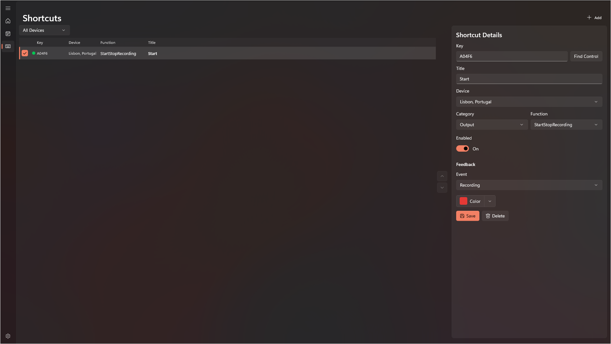
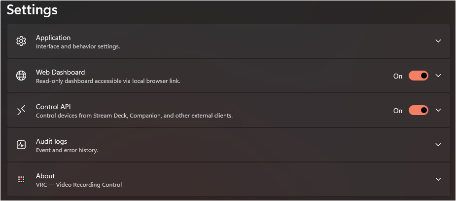
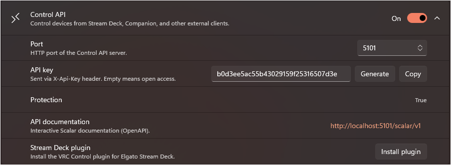

# VRC — Feature Reference

> User guide for VRC (Video Recording Control Hub) application features.

---

## 0. Installation (MSIX)

VRC is distributed as an MSIX package. Because the package is signed with a self-signed certificate, you need to install the certificate before installing the application.

### Step 1 — Install the Certificate

> Administrator rights are required.

1. Open the `.msix` file properties and export the signing certificate, or locate the separate `.cer` file provided alongside the installer.

2. Run the **Certificate Import Wizard** (`certlm.msc` or right-click the `.cer` → *Install Certificate*).

   

3. Select **Local Machine** as the store location.

   

4. Choose **Place all certificates in the following store** and browse to **Trusted People**.

   

   .png)

5. Complete the wizard and confirm the successful import.

   

   

### Step 2 — Install the Application

1. Double-click the `.msix` file to launch the installer.

   

2. Review the package contents and click **Install**.

   

---

## 1. Dashboard

The main screen of the application — a grid of connected device cards with real-time monitoring.

### Command Bar

| Action | Shortcut | Description |
|--------|----------|-------------|
| **Add vMix** | `Ctrl+N` | Opens the dialog to add a new vMix device |
| **Last Session** | — | Load the last saved session |
| **Save Preset** | `Ctrl+S` | Save current device configuration to the selected preset |
| **Card Size** | — | Cycle through device card sizes |

The status bar displays the current preset name and the number of connected devices.

#### Additional Commands (overflow menu "⋯")

| Action | Shortcut | Description |
|--------|----------|-------------|
| **Save As…** | `Ctrl+Shift+S` | Save configuration under a new name |
| **Delete Preset** | — | Delete the selected preset |
| **Export Preset** | — | Export preset to a file for transfer or backup |
| **Import Preset** | — | Import preset from a file |
| **Export Configuration** | — | Export full application configuration |
| **Import Configuration** | — | Import full application configuration |

### Card Display

- Device cards are arranged in an adaptive grid that automatically adjusts to the window size.
- **Pagination** — when there are many devices, cards are split across pages with a dot indicator for navigation. Mouse wheel scrolling is supported.

---

## 2. vMix Device Management

### Adding a Device

When adding a new vMix device, the following fields are specified:

- **Name** — custom name (up to 20 characters).
- **IP Address** — address of the machine running vMix.
- **HTTP Port** — vMix Web API port.
- **TCP Port** — TCP API port (configured automatically).
- **Polling Interval** — data refresh rate (250–5000 ms).
- **Login and Password** — credentials for authorization (if required).
- **Transport Mode** — communication method with vMix (HTTP, TCP, etc.). A warning about limitations is displayed when HTTP is selected.
- **Time Zone** — time zone assignment for the device to ensure correct time display during remote operation.

### Connectivity Check (Probe)

Before saving, you can test the connection to the device. The result and details are displayed directly in the dialog.

### Connection Options

- **Auto-Connect** — automatically connect to the device on application startup.
- **Auto-Reconnect** — automatically restore the connection when it is lost.

### Device Actions

Available through the card context menu:

- **Streaming Settings** — open the streaming channel management dialog.
- **Edit** — modify connection parameters.
- **WMI Settings** — configure remote PC monitoring.
- **Logs** — view the device event log.
- **Delete** — remove the device from the configuration.
- **Move to…** — move the device between groups.

---

## 3. Device Card

Each connected vMix device is displayed as a card with full real-time information. Below is a detailed description of all vMix control features available directly from the card.

### 3.1. Header

- Device name, IP address, transport mode.
- vMix version and edition, preset name.
- Device time zone.
- Color-coded connection status indicator.
- **Context menu (⋯)** — streaming settings, edit, WMI, logs, delete, move between groups.

### 3.2. Status Indicators

Interactive indicators — clicking toggles the corresponding vMix function:

| Indicator | Click | Details |
|-----------|-------|---------|
| **Streaming** | Start/stop all channels | Individual channel indicators 1–5 (each clickable). Number of channels depends on vMix edition |
| **Recording** | Start/stop recording | Primary and secondary recorder indicators, recording duration timer |
| **Multicorder** | Start/stop multi-recording | Displayed only when supported by the vMix edition |
| **Replay** | Start/stop Instant Replay recording | Displayed only when supported by the vMix edition |
| **External** | Toggle external output on/off | Tooltip with output configuration details |
| **Fullscreen** | Toggle fullscreen mode on/off | Tooltip with current settings |
| **Playlist** | Start/stop playlist | — |
| **Overlay** | Disable all overlays | Individual indicators per layer (each clickable separately) |

### 3.3. Program Monitor

Section displaying the current source in Program/Preview with audio levels.

#### Monitor Source Selection

Via the dropdown menu or by scrolling the mouse wheel:

| Source | Description |
|--------|-------------|
| **Program** | Main program output |
| **Preview** | Preview output |
| **PRV\|PGM** | Automatic — displays the active source |
| **Output 1–4** | External outputs (Output 3–4 when supported) |
| **Overlay 1–8** | Overlay layers (Overlay 5–8 with extended overlays) |

#### Information Panel

- **Current input name** — name and label of the playing source.
- **Progress bar** — for playable sources (video), showing remaining time.
- **Playback status** — Play / Pause / Stop icons.
- **Loop** — loop indicator.
- **List position** — element index display for video lists.
- **Title text** — current text for title inputs.

#### Master Audio Meter

- Dual-channel (L/R) vertical Master bus level indicator.
- Gradient: green (normal) → yellow (headroom) → red (clipping).
- Tooltip with peak values (dBFS).

### 3.4. Inputs Tab — Input Control

List of all vMix inputs with pagination.

#### Available for each input:

**Primary actions (buttons):**

| Action | Description |
|--------|-------------|
| **GO / QuickPlay** | Transition to input (GO for vMix v29+, QuickPlay for earlier versions) |
| **Cut** | Instant switch to input via Cut |
| **Play / Pause** | Play / pause (for video inputs) |
| **Loop** | Toggle playback looping on/off |
| **Mute** | Mute / unmute input audio |

**Input overlays (4×2 grid):**

- Toggle overlay layers 1–8 individually by clicking.
- Overlay context menu for additional actions.

**Input context menu (right-click):**

| Action | Description |
|--------|-------------|
| **Active** | Send input to Program |
| **Preview** | Send input to Preview |
| **Restart** | Restart playback (for video) |
| **AutoPause** (On/Off) | Auto-pause when switching away from the input |
| **AutoPlay** (On/Off) | Auto-play when switching to the input |
| **AutoRestart** (On/Off) | Auto-restart on completion |
| **Video Source** (1–4) | Select video source for Video Call inputs |
| **Audio Source** | Select audio source for Video Call: Master, Headphones, Bus A–G |

**Indicators:**

- Audio levels (dual-channel L/R meter) for each input.
- Color-coded border: green (Preview) / red (Program).
- Input type icon (camera, video, titles, etc.).

### 3.5. Audio Tab — Audio Mixer

Full-featured audio mixer with separate control of the master bus, buses, and inputs.

#### Master Bus

| Action | Description |
|--------|-------------|
| **Mute** | Mute / unmute Master |
| **Volume slider** | Master level adjustment (0–100%) via popup fader |
| **Audio meter** | Dual-channel L/R level indicator |

#### Audio Buses (Bus A–G)

For each available bus:

| Action | Description |
|--------|-------------|
| **Mute** | Mute / unmute bus |
| **Send to Master (M)** | Route bus to master |
| **Volume slider** | Bus level adjustment (0–100%) |
| **Solo (S)** | Solo-listen the bus |
| **Audio meter** | Dual-channel L/R level indicator |

#### Per-Input Audio

For each input with audio:

| Action | Description |
|--------|-------------|
| **Mute** | Mute / unmute input audio |
| **AFV** | Audio Follow Video — automatic audio control on switching |
| **Routing (M, A–G)** | Assign input to buses: Master and Bus A–G (individually, by click) |
| **Volume slider** | Input level adjustment (0–100%) via popup fader |
| **Solo (S)** | Solo-listen the input |
| **Audio meter** | Dual-channel L/R level indicator |

### 3.6. List Tab — Video List Management

Video list (playlist) management for vMix. Displayed when video lists are present.

#### Information Panel

- Current list name and its state (Playing / Paused / Stopped).
- Position / duration / remaining time.
- Number of items in the list.
- Playback progress bar.

#### Item List

- Display of all files in the list with duration.
- Color highlight for the currently playing item.
- Enabled/disabled item indicator.
- **Context menu**: Select, Remove (remove from list).

#### Playback Controls

| Button | Description |
|--------|-------------|
| **⏮ Previous** | Previous list item |
| **⏯ Play / Pause** | Play / pause |
| **⏭ Next** | Next list item |
| **🔀 Shuffle** | Shuffle the list |
| **🔁 Loop** | Loop the list |

#### Additional Commands (overflow menu "⋯")

| Command | Description |
|---------|-------------|
| **Play Out** | Play with automatic completion |
| **Auto Next** | Auto-advance to the next item |
| **Auto First** | Auto-return to the first item |

#### List Navigation

- Switch between multiple video lists via the dot indicator (PipsPager).

### 3.7. Outputs Tab — Output Control

Detailed display and control of vMix outputs.

#### Fullscreen Outputs

| Output | Description |
|--------|-------------|
| **Fullscreen 1** | Primary fullscreen output — source selection via SplitButton |
| **Fullscreen 2** | Secondary fullscreen output (when dual-monitor support is available) |

#### External Outputs (Output 1–4)

For each output, the following is displayed:

- **Source** — currently assigned source (changeable for Output 2–4).
- **NDI** — NDI streaming status (On/Off).
- **OMT** — OMT output status (On/Off).
- **SRT** — SRT streaming status (clickable to toggle).

> Output 3 and Output 4 are displayed only for vMix editions with four external outputs.

### 3.8. Replay Tab — Instant Replay

Section for Instant Replay control (implementation in progress).

### 3.9. Scheduler Tab — Device Schedule

Compact list of scheduled tasks for the given device.

- Display of upcoming tasks: time, function, parameters, status.
- Time-until-next-task indicator.
- **Open Scheduler** button — navigate to the full scheduler page.

### 3.10. Card Footer

| Element | Description |
|---------|-------------|
| **🔒 Lock** | Protection against accidental actions on the card. When active, control buttons are locked |
| **🔽 Collapse Audio** | Show/hide the audio section (with icon rotation animation) |
| **🔔 Notifications** | Enable/disable notifications for a specific device (green — on, gray — off) |
| **⚠ Errors** | Display of current connection errors (in red) |
| **⏳ Spinner** | Loading indicator while an operation is in progress |
| **🔘 Connection Toggle** | Enable/disable connection to the device |

---

## 4. PC Health Monitoring

Remote collection of workstation metrics for the machine running vMix:

- **CPU** — processor load (with critical value highlighting).
- **GPU 3D** — graphics card load (3D rendering).
- **GPU Encode** — hardware video encoder load.

Data is collected via **WMI** (Windows Management Instrumentation). WMI settings are accessible from the card menu. When remote monitoring is unavailable, WMI/RPC error information is displayed.

---

## 5. Streaming Settings

A dedicated dialog for managing streaming channels of a specific device:

- Individual toggles (Start/Stop) for each channel.
- Connection status and vMix version display.
- Edition and IP address information.

---

## 6. Task Scheduler

Centralized management of deferred and recurring commands for all devices.

### Task Creation

- **Name** — custom task name.
- **Device** — target device selection.
- **Category and Function** — command selection from a hierarchical catalog.
- **Parameters** — additional command parameters (dynamically dependent on the selected function).
- **Schedule** — type: one-time / daily / weekly.
- **Time and Date** — exact execution moment (24-hour format).
- **Retries** — number of retry attempts on failure (1–10).
- **Enable/Disable** — individually per task.

### Task Management

- **Global toggle** — enable/disable the entire scheduler.
- **Filtering** — by device and by status.
- **Tabs**: all tasks, upcoming (24 h), errors.

### Bulk Actions

| Action | Description |
|--------|-------------|
| **Hold** | Suspend selected tasks |
| **Run Now** | Immediately execute selected tasks |
| **+5 / +10 / +15 min** | Postpone execution by the specified time |
| **Cancel** | Cancel selected tasks |
| **Restore** | Restore canceled tasks |

### Additional Details

- Indication of disconnected devices in the task list.
- Warning banner when the scheduler is disabled.
- Last execution result display in the details panel.

---

## 7. Shortcuts (External Controller Integration)

Binding external controller buttons (Stream Deck, Companion, Touch Portal, etc.) to VRC device commands. All configuration is done entirely within VRC — the external device acts as a "thin client" that only reports button presses.

> The approach mirrors the vMix Shortcuts model: no configuration is needed on the controller side.

### How It Works

1. The user drags a "VRC Control" action onto a Stream Deck button — **done**. No additional setup is required on the controller side.
2. The button automatically receives a unique ID (the action UUID from the Stream Deck SDK).
3. The plugin connects to VRC's local Control API (`localhost:5101`) via SignalR.
4. In VRC, the user opens **Shortcuts** and creates a new shortcut by clicking **Add**.
5. The **Find Control** dialog opens — the user presses a physical button on the controller.
6. VRC captures the button ID and creates a `ShortcutEntry` linked to that key.
7. The user configures the command: **Device → Category → Function → Parameters**.
8. When the button is pressed during operation, VRC looks up the shortcut by key and executes the bound command on the target device.

### Page Layout

Master-detail layout (similar to the Scheduler page).

#### Command Bar

| Action | Description |
|--------|-------------|
| **Add** | Create a new shortcut (opens the detail panel in creation mode) |

#### Master Panel (Left — Shortcut List)

- **Device filter** — filter shortcuts by target device (ComboBox with an "All devices" option).
- Table columns: checkbox (enabled/disabled), status indicator, Key, Device, Function, Title.
- Row selection highlights the item and loads it into the detail panel.
- Clicking an empty area deselects the current shortcut.
- **Reorder arrows** (▲ / ▼) — move the selected shortcut up or down in the list.

#### Detail Panel (Right — Shortcut Editor)

When no shortcut is selected, an empty state is displayed with a prompt to select or create a shortcut.

When a shortcut is selected or being created:

| Field | Description |
|-------|-------------|
| **Key** | External button identifier (read-only, set via Find Control) |
| **Find Control** | Opens the button detection dialog |
| **Title** | Human-readable name for the shortcut |
| **Device** | Target device for command execution |
| **Category** | Command category from the hierarchical catalog |
| **Function** | Specific function within the category |
| **Parameters** | Dynamic parameters dependent on the selected function |
| **Enabled** | Toggle switch to enable/disable the shortcut |

#### Feedback Settings

Configures visual feedback sent back to the external controller button.

| Field | Description |
|-------|-------------|
| **Event** | ACTS event type for feedback (e.g., Recording, Streaming, Input, Overlay, etc.) |
| **Input Number** | Input number for input-bound events (shown only for relevant event types) |
| **Color** | Feedback color for the button when the event is active (8 preset colors with a palette picker) |

Available feedback events:

| Category | Events |
|----------|--------|
| **Global** | Recording, Streaming, External, Fullscreen, FadeToBlack, MasterAudio, Bus A–G Audio |
| **Input-bound** | Input (Program), InputPreview, InputPlaying, InputAudio, InputSolo, InputLoop, Input Bus routing (A–G, Master), InputAudioAuto |
| **Overlays** | Overlay 1–8 |

#### Action Buttons

| Button | Description |
|--------|-------------|
| **Save** | Save the shortcut configuration |
| **Cancel** | Cancel creation (visible only in creation mode) |
| **Delete** | Delete the selected shortcut |

### Find Control Dialog

A modal dialog for detecting external controller buttons:

1. Displays a progress ring and a prompt: "Press a button on your controller…"
2. When a button press is received via SignalR (`IdentifyButton`), the dialog shows the captured button ID.
3. The user confirms with OK — the key is assigned to the shortcut.

> The `IdentifyButton` method is separate from `execute` — pressing a button during detection does **not** trigger the bound command.

### Shortcut Execution Flow

1. External device sends `POST /api/shortcuts/execute { "buttonId": "uuid" }` to `localhost:5101`.
2. VRC: `ShortcutExecutor.ExecuteByKeyAsync(buttonId)` → `ShortcutStore.FindByKey` → check `IsEnabled` → `DeviceManager.GetDeviceById` → `DeviceClient.SendAsync(DeviceCommand)`.
3. If feedback is configured, VRC sends the current state back to the controller via SignalR.

---

## 8. Application Settings

### General

| Parameter | Description |
|-----------|-------------|
| **Language** | Interface language selection (Russian / English) |
| **Minimize to Tray** | Application minimizes to the system tray instead of the taskbar |
| **Auto-Start** | Auto-launch the application on Windows login |
| **Multiple Instances** | Allow running multiple copies of the application |

### Notifications

| Parameter | Description |
|-----------|-------------|
| **Notifications** | Enable/disable Windows Toast notifications |
| **Mode** | All / Critical / Broadcast / Off |
| **Connection Notifications** | Alerts on device connect/disconnect |
| **Silent Mode** | Suppress notification sounds |

### Web Dashboard

| Parameter | Description |
|-----------|-------------|
| **Enable** | Activate the built-in web server |
| **Port** | Port configuration (1–65535) |
| **Local URL** | Link to the dashboard for this PC |
| **LAN Addresses** | List of addresses for LAN access |

### Logs and Diagnostics

| Parameter | Description |
|-----------|-------------|
| **Device Logs** | Open the device log folder |
| **GC Monitor** | Garbage collector monitoring status and logs |

### About

| Parameter | Description |
|-----------|-------------|
| **Version** | Current application version |
| **Updates** | Check, download, and install updates with progress |
| **Release Notes** | Link to the release page |
| **Reset Settings** | Restore all settings to defaults |

### Control App

Configuration of the built-in Control API server used by external controllers (Stream Deck, Companion, Touch Portal, etc.).

| Parameter | Description |
|-----------|-------------|
| **Enable** | Activate the Control API server |
| **Port** | Port for the Control API (default: `5101`) |

---

## 9. Web Dashboard

Built-in read-only dashboard accessible from any browser on the local network.

- **Real-time updates** via SignalR with automatic reconnection.
- Display of all connected devices with indicators:
  - **REC** — recording.
  - **STREAM** — streaming.
  - **EXT** — external output.
  - **MCR** — multicorder.
  - **FS** — fullscreen mode.
  - **FTB** — Fade to Black.
- **Audio meters** — audio level visualization.
- LAN access via a configurable port.

---

## 10. Navigation

- Left sidebar with a tree structure of devices (groups and subgroups).
- Quick access to **Settings** via the built-in navigation button.
- Dedicated **Scheduler** page for global management of all tasks.
- Dedicated **Shortcuts** page for external controller button bindings.
- Page caching — state is preserved when switching between sections.
