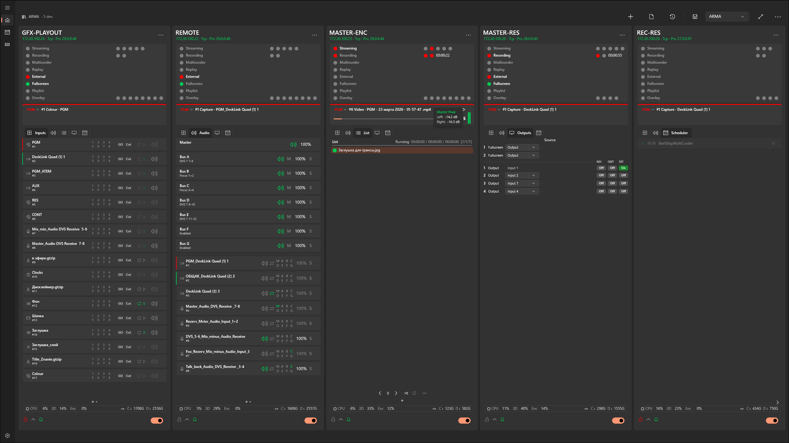

[En](README.md) | [Ru](README-ru.md)

# VRC (Video Recording Control Hub)

💡 **Please leave all your feedback in [GitHub Issues](https://github.com/Kotin-ak/VRC-Releases/issues) — your input is the main fuel for this project!** Every single review is critical for the app's development. Whether it's a bug report, a feature request for your studio, or just a quick *"it works perfectly on my 5 servers"* — drop it in the Issues tab. All development and update priorities are strictly based on GitHub tickets.

### Quick Links

* 📥 **[Download Latest Release](https://github.com/Kotin-ak/VRC-Releases/releases)**
* 🐛 [Report a Bug / Issue](https://github.com/Kotin-ak/VRC-Releases/issues)

### 🎬 Quick Demo

https://github.com/user-attachments/assets/7c67069e-30be-4646-a089-7777d7c0cc92

---

**VRC** is a centralized Windows application designed to remotely monitor and control multiple vMix instances from a single dashboard. Stop jumping between different computers to manage your broadcast. With VRC, you have full remote command over your vMix nodes:

* 🔴 **Full Remote Control:** Launch, stop, and manage Recording, Streaming, External outputs, and Multicorder with a single click or customizable keyboard shortcuts (ideal for Elgato Stream Deck).
* 📊 **Deep Monitoring:** Track CPU/GPU performance and monitor available storage space in real-time via WMI to prevent recording failures.
* ⏰ **Smart Automation:** Built-in Task Scheduler to automate your vMix commands based on precise timing.

*(Note: While the architecture is designed as a "Hub", the current release is heavily optimized for deep and stable integration exclusively with **vMix**).*

---

## 📋 Table of Contents

> [!IMPORTANT]
> **New to VRC? Start with the [📥 Installation Guide](#installation) before anything else.**

- [Why VRC?](#why-vrc-the-problem-it-solves)
- [⚙️ System Requirements](#requirements)
- [**📥 Installation** *(start here!)*](#installation)
- [**🚀 Quick Start** *(5 minutes)*](#quickstart)
- [1. Dashboard](#1-dashboard) *(Basic)*
- [2. vMix Device Management](#2-vmix-device-management) *(Basic)*
- [3. Device Card](#3-device-card) *(Basic)*
  - [3.1. Header](#31-header)
  - [3.2. Status Indicators](#32-status-indicators)
  - [3.3. Program Monitor](#33-program-monitor)
  - [3.4. Inputs Tab](#34-inputs-tab--input-control)
  - [3.5. Audio Tab](#35-audio-tab--audio-mixer)
  - [3.6. List Tab](#36-list-tab--video-list-management)
  - [3.7. Outputs Tab](#37-outputs-tab--output-control)
  - [3.8. Replay Tab](#38-replay-tab--instant-replay)
  - [3.9. Scheduler Tab](#39-scheduler-tab--device-schedule)
  - [3.10. Card Footer](#310-card-footer)
- [4. PC Health Monitoring](#4-pc-health-monitoring) *(Optional · Advanced)*
- [5. Streaming Settings](#5-streaming-settings) *(Basic)*
- [6. Task Scheduler](#6-task-scheduler) *(Advanced)*
- [7. Shortcuts](#7-shortcuts-external-controller-integration) *(Advanced · Optional)*
- [8. Application Settings](#8-application-settings) *(Basic)*
  - [8.1. General](#general)
  - [8.2. Notifications](#notifications)
  - [8.3. Web Dashboard (settings)](#web-dashboard-settings)
  - [8.4. Control API](#control-api)
  - [8.5. Logs and Diagnostics](#logs-and-diagnostics)
  - [8.6. About](#about)
- [9. Web Dashboard](#9-web-dashboard) *(Optional)*
- [10. Navigation](#10-navigation) *(Basic)*
- [❓ FAQ & Troubleshooting](#faq)

---
## Why VRC? (The Problem It Solves)

In professional live production, you rarely rely on a single machine. You might have one vMix PC for the main mix, another for instant replays, and a third for graphics or encoding. Monitoring and controlling all of them simultaneously usually requires a large crew or constantly switching between KVMs, which leads to missed cues, high stress, and potential on-air failures.

VRC was built to solve this exact problem. It turns any Windows tablet or laptop on your network into a **Master Control Room**.

### Who is this for?
* **Solo Operators & Small Crews:** Manage recording, streaming, and switching across multiple PCs without needing extra hands. Ideal for local sports, corporate events, and live gigs.
* **Esports Productions:** Control complex multi-node setups (player POVs, caster desks, main feed) from one central hub with precision timing.
* **Broadcast Engineers & Technical Directors:** Monitor CPU and GPU loads, audio levels, and crucially, **track remaining free disk space** across all nodes in real-time. Prevent stream crashes and ruined recordings before they happen.

---

<a id="requirements"></a>
## ⚙️ System Requirements

| Component | Requirement |
|-----------|-------------|
| **OS** | Windows 10 (build 19041+) or Windows 11 |
| **Architecture** | x64 only |
| **Runtime** | Windows App Runtime 2.0 *(bundled in the release package)* |
| **vMix** | Any version · v29+ recommended for full feature support (GO button) |
| **Network** | LAN access to vMix machines; default ports: HTTP `8088`, TCP `8099` |
| **WMI Monitoring** | *(Optional)* Windows credentials on each remote machine — see [Section 4](#4-pc-health-monitoring) |

---

<a id="installation"></a>
## 🛠 Installation (Important!)

> [!IMPORTANT]
> Because VRC is a locally signed .msix package, you **MUST** install the security certificate first, otherwise Windows will block the installation.

1. Download the `.zip` archive from the Releases page and extract it.
2. **Install the security certificate:** Right-click the certificate file, select Install, and place it in **"Local Machine" -> "Trusted People"**.
3. **Install Dependencies:** The extracted folder contains a `Dependencies` directory with additional required resources. Since this is a 64-bit Windows package, navigate to `Dependencies\x64` and install the Windows App Runtime by double-clicking: `Microsoft.WindowsAppRuntime.2.0-preview1.msix`
4. **Install VRC:** Finally, double-click the main VRC `.msix` file to install the app.

---

<a id="quickstart"></a>
## 🚀 Quick Start (First 5 Minutes)

> [!TIP]
> **Already installed?** Follow these steps to get up and running immediately.

1. **Launch VRC** — you'll see an empty Dashboard.
2. Click **Add vMix** (`Ctrl+N`), enter your vMix machine's IP address and port, then click **Probe** to verify the connection.
3. Click **Save** — the device card appears on the Dashboard.
4. Wait for the connection indicator in the card header to turn **green** *(connected)*.
5. Click the **🔒 Lock icon** in the card footer to unlock controls — all buttons are locked by default to prevent accidental actions on air.

> ✅ **Done.** Click any status indicator — **REC**, **STREAM**, **EXT** — to control your vMix remotely.

---

## 1. Dashboard

The main screen of the application — a grid of connected device cards with real-time monitoring.

> [!TIP]
> **Controls not responding?** Each card has a **🔒 Lock** in its footer — active by default. Click it to unlock the card and enable all control buttons. See [3.10. Card Footer](#310-card-footer).

---




### Command Bar (Workspace Management)

**What are Presets and Configurations?**
* **Preset:** A saved group of vMix machines (your specific workspace). If you travel between different venues, you can save a preset for "Studio A" and another for "Away Tournament". Load a preset, and VRC instantly connects to the exact vMix nodes for that location without requiring you to re-enter IP addresses manually.
* **Configuration:** A master backup of your VRC application, including *all* your presets and global settings. Use this to quickly clone your entire VRC setup to a secondary or backup control laptop.

| Action | Shortcut | Business Value / Description |
|--------|----------|------------------------------|
| **Add vMix** | `Ctrl+N` | Connect a new vMix node to your current workspace |
| **Last Session** | — | Quickly restore the exact machines you were monitoring when you last closed VRC |
| **Save Preset** | `Ctrl+S` | Save your current grid of vMix machines to load them instantly next time |
| **Card Size** | — | Adjust how much screen space each device card takes |

The status bar displays the current preset name and the number of connected devices.

#### Additional Commands (overflow menu "⋯")

| Action | Shortcut | Business Value / Description |
|--------|----------|------------------------------|
| **Save As…** | `Ctrl+Shift+S` | Duplicate your current workspace under a new name (e.g., "Tournament Day 2") |
| **Delete Preset** | — | Remove a workspace setup you no longer need |
| **Export Preset** | — | Save a specific workspace layout to a file to share with another operator |
| **Import Preset** | — | Load a workspace layout provided by someone else |
| **Export Configuration** | — | Create a master backup of your entire VRC setup to easily migrate to another PC |
| **Import Configuration** | — | Restore your master backup on a new control laptop |


### Card Display

- Device cards are arranged in an adaptive grid that automatically adjusts to the window size.
- **Pagination** — when there are many devices, cards are split across pages with a dot indicator for navigation. Mouse wheel scrolling is supported.

---

## 2. vMix Device Management

### Adding a Device


When adding a new vMix device, the following fields are specified:

- **Name** — custom name (up to 20 characters).
- **IP Address** — address of the machine running vMix.
- **HTTP Port** — vMix Web API port.
- **TCP Port** — TCP API port (configured automatically).
- **Polling Interval** — data refresh rate (250–5000 ms).
- **Login and Password** — credentials for authorization (if required).
- **Transport Mode** — communication method with vMix (HTTP, TCP, etc.). A warning about limitations is displayed when HTTP is selected.
- **Time Zone** — time zone assignment for the device to ensure correct time display during remote operation.

### Connectivity Check (Probe)

Before saving, you can test the connection to the device. The result and details are displayed directly in the dialog.

### Connection Options

- **Auto-Connect** — automatically connect to the device on application startup.
- **Auto-Reconnect** — automatically restore the connection when it is lost.

### Device Actions

Available through the card context menu:

- **Streaming Settings** — open the streaming channel management dialog.
- **Edit** — modify connection parameters.
- **WMI Settings** — configure remote PC monitoring.
- **Logs** — view the device event log.
- **Delete** — remove the device from the configuration.
- **Move to…** — move the device between groups.

---

## 3. Device Card

Each connected vMix device is displayed as a card with full real-time information. 

> [!NOTE]
> **Safety First:** By default, all control actions on the card are **LOCKED** to prevent accidental clicks during a live broadcast. To enable control, you must first click the **Lock (🔒)** icon in the card footer.

### 3.1. Header

- Device name, IP address, transport mode.
- vMix version and edition, preset name.
- Device time zone.
- Color-coded connection status indicator.
- **Context menu (⋯)** — streaming settings, edit, WMI, logs, delete, move between groups.

### 3.2. Status Indicators


> [!NOTE]
> Some indicators (**Multicorder**, **Replay**, extended **Overlay** layers, additional **Output** channels) are only visible if your vMix edition and version support them. The **GO** button requires vMix v29+; earlier versions show **QuickPlay** instead.

Interactive indicators — clicking toggles the corresponding vMix function:

| Indicator | Click | Details |
|-----------|-------|---------|
| **Streaming** | Start/stop all channels | Individual channel indicators 1–5 (each clickable). Number of channels depends on vMix edition |
| **Recording** | Start/stop recording | Primary and secondary recorder indicators, recording duration timer |
| **Multicorder** | Start/stop multi-recording | Displayed only when supported by the vMix edition |
| **Replay** | Start/stop Instant Replay recording | Displayed only when supported by the vMix edition |
| **External** | Toggle external output on/off | Tooltip with output configuration details |
| **Fullscreen** | Toggle fullscreen mode on/off | Tooltip with current settings |
| **Playlist** | Start/stop playlist | — |
| **Overlay** | Disable all overlays | Individual indicators per layer (each clickable separately) |

### 3.3. Program Monitor


Section displaying the current source in Program/Preview with audio levels.

#### Monitor Source Selection

Via the dropdown menu or by scrolling the mouse wheel:

| Source | Description |
|--------|-------------|
| **Program** | Main program output |
| **Preview** | Preview output |
| **PRV\|PGM** | Automatic — displays the active source |
| **Output 1–4** | External outputs (Output 3–4 when supported) |
| **Overlay 1–8** | Overlay layers (Overlay 5–8 with extended overlays) |

#### Information Panel

- **Current input name** — name and label of the playing source.
- **Progress bar** — for playable sources (video), showing remaining time.
- **Playback status** — Play / Pause / Stop icons.
- **Loop** — loop indicator.
- **List position** — element index display for video lists.
- **Title text** — current text for title inputs.

#### Master Audio Meter

- Dual-channel (L/R) vertical Master bus level indicator.
- Gradient: green (normal) → yellow (headroom) → red (clipping).
- Tooltip with peak values (dBFS).

### 3.4. Inputs Tab — Input Control


List of all vMix inputs with pagination.

#### Available for each input:

**Primary actions (buttons):**

| Action | Description |
|--------|-------------|
| **GO / QuickPlay** | Transition to input (GO for vMix v29+, QuickPlay for earlier versions) |
| **Cut** | Instant switch to input via Cut |
| **Play / Pause** | Play / pause (for video inputs) |
| **Loop** | Toggle playback looping on/off |
| **Mute** | Mute / unmute input audio |

**Input overlays (4×2 grid):**

- Toggle overlay layers 1–8 individually by clicking.
- Overlay context menu for additional actions.

**Input context menu (right-click):**

| Action | Description |
|--------|-------------|
| **Active** | Send input to Program |
| **Preview** | Send input to Preview |
| **Restart** | Restart playback (for video) |
| **AutoPause** (On/Off) | Auto-pause when switching away from the input |
| **AutoPlay** (On/Off) | Auto-play when switching to the input |
| **AutoRestart** (On/Off) | Auto-restart on completion |
| **Video Source** (1–4) | Select video source for Video Call inputs |
| **Audio Source** | Select audio source for Video Call: Master, Headphones, Bus A–G |

**Indicators:**

- Audio levels (dual-channel L/R meter) for each input.
- Color-coded border: green (Preview) / red (Program).
- Input type icon (camera, video, titles, etc.).

### 3.5. Audio Tab — Audio Mixer

Full-featured audio mixer with separate control of the master bus, buses, and inputs.

#### Master Bus

| Action | Description |
|--------|-------------|
| **Mute** | Mute / unmute Master |
| **Volume slider** | Master level adjustment (0–100%) via popup fader |
| **Audio meter** | Dual-channel L/R level indicator |


#### Audio Buses (Bus A–G)

For each available bus:

| Action | Description |
|--------|-------------|
| **Mute** | Mute / unmute bus |
| **Send to Master (M)** | Route bus to master |
| **Volume slider** | Bus level adjustment (0–100%) |
| **Solo (S)** | Solo-listen the bus |
| **Audio meter** | Dual-channel L/R level indicator |

#### Per-Input Audio


For each input with audio:

| Action | Description |
|--------|-------------|
| **Mute** | Mute / unmute input audio |
| **AFV** | Audio Follow Video — automatic audio control on switching |
| **Routing (M, A–G)** | Assign input to buses: Master and Bus A–G (individually, by click) |
| **Volume slider** | Input level adjustment (0–100%) via popup fader |
| **Solo (S)** | Solo-listen the input |
| **Audio meter** | Dual-channel L/R level indicator |

### 3.6. List Tab — Video List Management


Video list (playlist) management for vMix. Displayed when video lists are present.

#### Information Panel

- Current list name and its state (Playing / Paused / Stopped).
- Position / duration / remaining time.
- Number of items in the list.
- Playback progress bar.

#### Item List

- Display of all files in the list with duration.
- Color highlight for the currently playing item.
- Enabled/disabled item indicator.
- **Context menu**: Select, Remove (remove from list).

#### Playback Controls

| Button | Description |
|--------|-------------|
| **⏮ Previous** | Previous list item |
| **⏯ Play / Pause** | Play / pause |
| **⏭ Next** | Next list item |
| **🔀 Shuffle** | Shuffle the list |
| **🔁 Loop** | Loop the list |

#### Additional Commands (overflow menu "⋯")

| Command | Description |
|---------|-------------|
| **Play Out** | Play with automatic completion |
| **Auto Next** | Auto-advance to the next item |
| **Auto First** | Auto-return to the first item |

#### List Navigation

- Switch between multiple video lists via the dot indicator (PipsPager).

### 3.7. Outputs Tab — Output Control


Detailed display and control of vMix outputs.

#### Fullscreen Outputs

| Output | Description |
|--------|-------------|
| **Fullscreen 1** | Primary fullscreen output — source selection via SplitButton |
| **Fullscreen 2** | Secondary fullscreen output (when dual-monitor support is available) |

#### External Outputs (Output 1–4)

For each output, the following is displayed:

- **Source** — currently assigned source (changeable for Output 2–4).
- **NDI** — NDI streaming status (On/Off).
- **OMT** — OMT output status (On/Off).
- **SRT** — SRT streaming status (clickable to toggle).

> Output 3 and Output 4 are displayed only for vMix editions with four external outputs.

### 3.8. Replay Tab — Instant Replay

Section for Instant Replay control (implementation in progress).

### 3.9. Scheduler Tab — Device Schedule


Compact list of scheduled tasks for the given device.

- Display of upcoming tasks: time, function, parameters, status.
- Time-until-next-task indicator.
- **Open Scheduler** button — navigate to the full scheduler page.

### 3.10. Card Footer

| Element | Description |
|---------|-------------|
| **🔒 Lock** | Lock	Default state: ON. Protects against accidental actions. When active, all control buttons are locked. Click to toggle. |
| **🔽 Collapse Audio** | Show/hide the audio section (with icon rotation animation) |
| **🔔 Notifications** | Enable/disable notifications for a specific device (green — on, gray — off) |
| **⚠ Errors** | Display of current connection errors (in red) |
| **⏳ Spinner** | Loading indicator while an operation is in progress |
| **🔘 Connection Toggle** | Enable/disable connection to the device |

---

## 4. PC Health Monitoring


### PC Health Monitoring (WMI)

Remote collection of workstation metrics for the machine running vMix:
* CPU — processor load (with critical value highlighting).
* GPU 3D & Encode — graphics card and hardware video encoder load.
* Disks — free space monitoring.

Data is collected natively via Windows Management Instrumentation (WMI).

#### 🛠 Seamless WMI Configuration
Configuring WMI across a network usually involves tedious firewall and UAC tweaking. To make this painless, the VRC settings menu provides built-in PowerShell scripts to automate the setup:

1. Remote PC (Target vMix Machine): Click Copy -> Remote PC in VRC and run the script in PowerShell (as Administrator) on the target machine. This automatically configures WMI permissions, Windows Firewall, and UAC (LocalAccountTokenFilterPolicy) for remote access.
2. This PC (VRC Host): Click Copy -> This PC and run it locally to add the remote machine to your TrustedHosts list.
3. Credentials: Enter the Windows login and password of the remote PC.
   * *Workgroup:* Just use the username.
   * *Domain:* Use DOMAIN\username or .\username for local admin.
4. Network Ports: If you are monitoring across different subnets, ensure your corporate routers allow traffic over TCP port 135 and the dynamic RPC range (49152–65535).


---

## 5. Streaming Settings


A dedicated dialog for managing streaming channels of a specific device:

- Individual toggles (Start/Stop) for each channel.
- Connection status and vMix version display.
- Edition and IP address information.

---

## 6. Task Scheduler

Centralized management of deferred and recurring commands for all devices.

### Task Creation

- **Name** — custom task name.
- **Device** — target device selection.
- **Category and Function** — command selection from a hierarchical catalog.
- **Parameters** — additional command parameters (dynamically dependent on the selected function).
- **Schedule** — type: one-time / daily / weekly.
- **Time and Date** — exact execution moment (24-hour format).
- **Retries** — number of retry attempts on failure (1–10).
- **Enable/Disable** — individually per task.

### Task Management

- **Global toggle** — enable/disable the entire scheduler.
- **Filtering** — by device and by status.
- **Tabs**: all tasks, upcoming (24 h), errors.

### Bulk Actions

| Action | Description |
|--------|-------------|
| **Hold** | Suspend selected tasks |
| **Run Now** | Immediately execute selected tasks |
| **+5 / +10 / +15 min** | Postpone execution by the specified time |
| **Cancel** | Cancel selected tasks |
| **Restore** | Restore canceled tasks |

### Additional Details


- Indication of disconnected devices in the task list.
- Warning banner when the scheduler is disabled.
- Last execution result display in the details panel.

---

## 7. Shortcuts (External Controller Integration)


Binding external controller buttons (Stream Deck, Companion, Touch Portal, etc.) to VRC device commands. All configuration is done entirely within VRC — the external device acts as a "thin client" that only reports button presses.

> The approach mirrors the vMix Shortcuts model: no configuration is needed on the controller side.

### How It Works


1. The user drags a "VRC Control" action onto a Stream Deck button — **done**. No additional setup is required on the controller side.
2. The button automatically receives a unique ID (the action UUID from the Stream Deck SDK).
3. The plugin connects to VRC's local Control API (`localhost:5101`) via SignalR.
4. In VRC, the user opens **Shortcuts** and creates a new shortcut by clicking **Add**.
5. The **Find Control** dialog opens — the user presses a physical button on the controller.
6. VRC captures the button ID and creates a `ShortcutEntry` linked to that key.
7. The user configures the command: **Device → Category → Function → Parameters**.
8. When the button is pressed during operation, VRC looks up the shortcut by key and executes the bound command on the target device.

### Page Layout


Master-detail layout (similar to the Scheduler page).

#### Command Bar

| Action | Description |
|--------|-------------|
| **Add** | Create a new shortcut (opens the detail panel in creation mode) |

#### Master Panel (Left — Shortcut List)

- **Device filter** — filter shortcuts by target device (ComboBox with an "All devices" option).
- Table columns: checkbox (enabled/disabled), status indicator, Key, Device, Function, Title.
- Row selection highlights the item and loads it into the detail panel.
- Clicking an empty area deselects the current shortcut.
- **Reorder arrows** (▲ / ▼) — move the selected shortcut up or down in the list.

#### Detail Panel (Right — Shortcut Editor)

When no shortcut is selected, an empty state is displayed with a prompt to select or create a shortcut.

When a shortcut is selected or being created:

| Field | Description |
|-------|-------------|
| **Key** | External button identifier (read-only, set via Find Control) |
| **Find Control** | Opens the button detection dialog |
| **Title** | Human-readable name for the shortcut |
| **Device** | Target device for command execution |
| **Category** | Command category from the hierarchical catalog |
| **Function** | Specific function within the category |
| **Parameters** | Dynamic parameters dependent on the selected function |
| **Enabled** | Toggle switch to enable/disable the shortcut |

#### Feedback Settings

Configures visual feedback sent back to the external controller button.

| Field | Description |
|-------|-------------|
| **Event** | ACTS event type for feedback (e.g., Recording, Streaming, Input, Overlay, etc.) |
| **Input Number** | Input number for input-bound events (shown only for relevant event types) |
| **Color** | Feedback color for the button when the event is active (8 preset colors with a palette picker) |

Available feedback events:

| Category | Events |
|----------|--------|
| **Global** | Recording, Streaming, External, Fullscreen, FadeToBlack, MasterAudio, Bus A–G Audio |
| **Input-bound** | Input (Program), InputPreview, InputPlaying, InputAudio, InputSolo, InputLoop, Input Bus routing (A–G, Master), InputAudioAuto |
| **Overlays** | Overlay 1–8 |

#### Action Buttons

| Button | Description |
|--------|-------------|
| **Save** | Save the shortcut configuration |
| **Cancel** | Cancel creation (visible only in creation mode) |
| **Delete** | Delete the selected shortcut |

### Find Control Dialog

A modal dialog for detecting external controller buttons:

1. Displays a progress ring and a prompt: "Press a button on your controller…"
2. When a button press is received via SignalR (`IdentifyButton`), the dialog shows the captured button ID.
3. The user confirms with OK — the key is assigned to the shortcut.

> The `IdentifyButton` method is separate from `execute` — pressing a button during detection does **not** trigger the bound command.

### Shortcut Execution Flow

1. External device sends `POST /api/shortcuts/execute { "buttonId": "uuid" }` to `localhost:5101`.
2. VRC: `ShortcutExecutor.ExecuteByKeyAsync(buttonId)` → `ShortcutStore.FindByKey` → check `IsEnabled` → `DeviceManager.GetDeviceById` → `DeviceClient.SendAsync(DeviceCommand)`.
3. If feedback is configured, VRC sends the current state back to the controller via SignalR.

---

## 8. Application Settings

### General


| Parameter | Description |
|-----------|-------------|
| **Language** | Interface language selection (Russian / English) |
| **Minimize to Tray** | Application minimizes to the system tray instead of the taskbar |
| **Auto-Start** | Auto-launch the application on Windows login |
| **Multiple Instances** | Allow running multiple copies of the application |

### Notifications

| Parameter | Description |
|-----------|-------------|
| **Notifications** | Enable/disable Windows Toast notifications |
| **Mode** | All / Critical / Broadcast / Off |
| **Connection Notifications** | Alerts on device connect/disconnect |
| **Silent Mode** | Suppress notification sounds |

### Web Dashboard


| Parameter | Description |
|-----------|-------------|
| **Enable** | Activate the built-in web server |
| **Port** | Port configuration (1–65535) |
| **Local URL** | Link to the dashboard for this PC |
| **LAN Addresses** | List of addresses for LAN access |

### Control API

| Parameter | Description |
|-----------|-------------|
| **Enable** | Activate the built-in HTTP Control API server |
| **Port** | Port for the API server (1–65535); default `5101` |
| **API Key** | Authentication key for HTTP requests — use **Generate** to create a random key, **Copy** to copy it to clipboard |
| **Status** | Whether the API key is currently configured |
| **Documentation** | Link to the full API reference |
| **Stream Deck Plugin** | Install the VRC Control action plugin for Elgato Stream Deck |

> When an API Key is configured, all HTTP requests must include the `X-Api-Key: {key}` header.

#### HTTP Endpoints

| Method | Endpoint | Body | Description |
|--------|----------|------|-------------|
| `GET` | `/api/status` | — | VRC server status, version, device count, and device list |
| `GET` | `/api/devices` | — | List of all registered devices |
| `GET` | `/api/devices/{id}` | — | Device info by ID |
| `POST` | `/api/devices/{id}/command` | `ApiCommandRequest` | Execute a named command on the specified device |
| `GET` | `/api/devices/{id}/commands` | — | Available commands for the device (grouped by category) |
| `GET` | `/api/devices/{id}/commands/{category}/{function}/parameters` | — | Parameters for a specific function |
| `POST` | `/api/shortcuts/execute` | `ApiShortcutExecuteRequest` | Execute a shortcut by external button ID |

> **Audit logging:** `POST /api/shortcuts/execute` writes `CMD [External]` to the device audit log. `POST /api/devices/{id}/command` writes `CMD [API]` to the device audit log.

**`GET /api/status` — response:**
```json
{
  "isRunning": true,
  "deviceCount": 2,
  "version": "1.5.0",
  "devices": [
    { "id": "...", "name": "Studio A", "type": "vMix", "ipAddress": "192.168.1.10", "isConnected": true }
  ]
}
```

**`POST /api/devices/{id}/command` — request body:**
```json
{ "deviceId": "...", "commandName": "StartRecording", "parameters": null }
```

**`POST /api/shortcuts/execute` — request body:**
```json
{ "buttonId": "uuid-of-stream-deck-action" }
```

#### SignalR Hub (`/hubs/control`)

| Direction | Method | Payload | Description |
|-----------|--------|---------|-------------|
| Server → Client | `ButtonFeedback` | `ApiButtonFeedback` | Button state update sent back to the external controller |
| Server → Client | `ActivatorEvent` | `ApiActivatorEvent` | Real-time ACTS event broadcast (tally, audio levels, recording status) |
| Client → Server | `IdentifyButton` | `buttonId` | Button identification request during shortcut setup |

**`ButtonFeedback` payload:**
```json
{ "buttonKey": "91AC8", "isOn": true, "eventType": "Recording", "color": "#E53935" }
```

**`ActivatorEvent` payload:**
```json
{ "deviceId": "...", "eventType": "Input", "inputNumber": 3, "value": 1.0, "isOn": true }
```

### Logs and Diagnostics


| Parameter | Description |
|-----------|-------------|
| **Device Logs** | Open the device log folder |
| **GC Monitor** | Garbage collector monitoring status and logs |

#### Log File Structure

All log files are stored in the app's local data folder and are accessible via the **Device Logs** button.

| File | Retention | Contents |
|------|-----------|----------|
| `{DeviceName}_{id}/audit-YYYYMMDD.log` | 30 days | Per-device audit: connections, state changes, ACTS events, operator commands |
| `Updates/update-YYYYMMDD.log` | 90 days | Update history: check, download, install, errors with HRESULT codes |
| `_system/gc-health-YYYYMMDD.log` | 30 days | .NET memory metrics: heap, working set, GC generation counters, fragmentation |
| `_system/hw-monitor-YYYYMMDD.log` | 30 days | Hardware threshold events: CPU/GPU/disk alerts and recoveries |

#### Per-device audit log (`audit-*.log`)

| Event | Example entry |
|-------|---------------|
| **Connection** | `Connected (192.168.1.10:8099, Tcp)` |
| **Reconnect / error** | `Reconnect (Reconnecting/Network): Host unreachable` |
| **Disconnection** | `Disconnected (UserRequested)` |
| **Initial snapshot** | `Snapshot Rec=False Stream=False Ext=False MC=False FS=False` |
| **Lock / Unlock** | `🔓 Unlocked (Lock)` / `🔒 Locked (Lock)` |
| **State change** | `Δ Recording: false → true Rec=—` |
| **State change** | `Δ Streaming: true → false Rec=00:15:42` |
| **ACTS event** | `ACTS Recording Value=1 Rec=00:15:42` |
| **ACTS event** | `ACTS Overlay2 Input=13 Value=1 Rec=—` |
| **UI button (intent)** | `CMD [Operator] Send: StartStopRecording Rec=—` |
| **UI button (success)** | `CMD [Operator] Send: StartStopRecording -> OK` |
| **UI button (error)** | `CMD [Operator] Send: StartStopStreaming -> ERROR: timeout` |
| **Scheduler (success)** | `CMD [Timer] Send: StartRecording -> OK 'Morning Rec' (attempt 1/3)` |
| **Scheduler (error)** | `CMD [Timer] Send: StartRecording -> ERROR: not connected 'Morning Rec' (attempt 2/3)` |
| **Shortcut (success)** | `CMD [External] Send: StartRecording -> OK 'REC Button'` |
| **Shortcut (error)** | `CMD [External] Send: StartRecording -> ERROR: timeout 'REC Button'` |

#### Hardware threshold log (`_system/hw-monitor-*.log`)

Writes only on threshold crossings — not on every poll cycle.

| Threshold | Trigger condition |
|-----------|-------------------|
| **CPU** | Usage > 90% (crossed / recovered) |
| **GPU** | Encode usage > 95% (crossed / recovered) |
| **Disk** | Free < 10 GB or free < 10% (crossed / recovered) |

Example entries:

```
WRN [192.168.1.10] CPU load crossed threshold: 92.3% (threshold 90%)
INF [192.168.1.10] CPU load recovered: 74.5%
WRN [192.168.1.10] GPU Encode load crossed threshold: 96.0% (threshold 95%)
WRN [192.168.1.10] Disk C: free space dropped below threshold — 8.5 GB (6.2% free)
INF [192.168.1.10] Disk C: free space recovered — 15.2 GB (11.4% free)
```

### About


| Parameter | Description |
|-----------|-------------|
| **Version** | Current application version |
| **Updates** | Check, download, and install updates with progress |
| **Release Notes** | Link to the release page |
| **Reset Settings** | Restore all settings to defaults |

### ⌨️ Keyboard Shortcuts Reference

| Shortcut | Action |
|----------|--------|
| `Ctrl+N` | Add a new vMix device |
| `Ctrl+S` | Save current preset |
| `Ctrl+Shift+S` | Save preset under a new name (Save As…) |

---

## 9. Web Dashboard


Built-in read-only dashboard accessible from any browser on the local network.

- **Real-time updates** via SignalR with automatic reconnection.
- Display of all connected devices with indicators:
  - **REC** — recording.
  - **STREAM** — streaming.
  - **EXT** — external output.
  - **MCR** — multicorder.
  - **FS** — fullscreen mode.
  - **FTB** — Fade to Black.
- **Audio meters** — audio level visualization.
- LAN access via a configurable port.

---

## 10. Navigation

- Left sidebar with a tree structure of devices (groups and subgroups).
- Quick access to **Settings** via the built-in navigation button.
- Dedicated **Scheduler** page for global management of all tasks.
- Dedicated **Shortcuts** page for external controller button bindings.
- Page caching — state is preserved when switching between sections.

---

<a id="faq"></a>
## ❓ FAQ & Troubleshooting

### VRC cannot connect to vMix
- Verify that vMix is running and **Web Controller is enabled** (vMix Settings → Web Controller).
- Double-check the IP address and port (default HTTP: `8088`, TCP: `8099`).
- Ensure the Windows Firewall on the vMix machine allows inbound connections on that port.
- Use the **Probe** button in the Add/Edit device dialog to test connectivity before saving.

### Card buttons don’t respond to clicks
- Controls are **locked by default** to prevent accidental on-air actions.
- Click the **🔒 Lock icon** in the card footer to unlock the card.

### WMI monitoring shows no data
- Run the PowerShell setup scripts from VRC Settings → WMI (see [Section 4](#4-pc-health-monitoring)).
- Use the correct credential format: Workgroup → `username`; Domain → `DOMAIN\username` or `.\username`.
- Ensure TCP port `135` and the dynamic RPC range (`49152–65535`) are open on your network.

### Certificate fails to install
- Run the certificate installer as **Administrator** (right-click → Run as administrator).
- Ensure you place it in **Local Machine → Trusted People** (not Current User).

### Some indicators (Multicorder, Replay, GO) are missing
- These features depend on your **vMix edition and version**.
- Multicorder and Replay are only available in higher vMix editions.
- The **GO** button requires **vMix v29+**; earlier versions show **QuickPlay** instead.

### Notifications are not appearing
- Check **Settings → Notifications** and ensure the mode is not set to *Off*.
- Confirm Windows system notifications for VRC are allowed (Windows Settings → System → Notifications).
