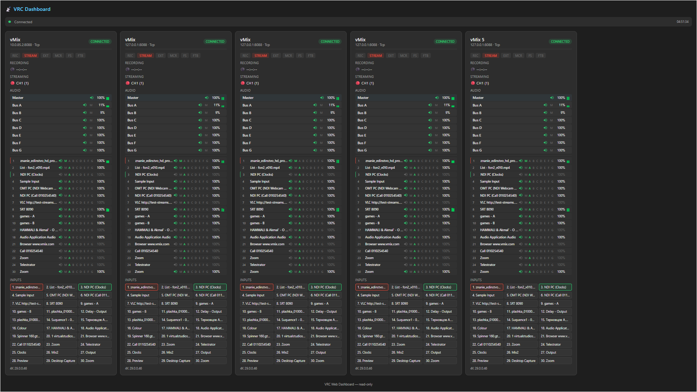

# VRC — Справочник возможностей

> Руководство пользователя по функциям приложения VRC (Video Recording Control Hub).

---

## 1. Дашборд

Главный экран приложения — сетка карточек подключённых устройств с мониторингом в реальном времени.

### Панель команд

| Действие | Горячая клавиша | Описание |
|----------|----------------|----------|
| **Добавить vMix** | `Ctrl+N` | Открывает диалог добавления нового устройства vMix |
| **Последняя сессия** | — | Загрузка последней сохранённой сессии |
| **Сохранить пресет** | `Ctrl+S` | Сохранение текущей конфигурации устройств в выбранный пресет |
| **Размер карточек** | — | Циклическое переключение размера карточек устройств |

В строке состояния отображается имя текущего пресета и количество подключённых устройств.

#### Дополнительные команды (меню «⋯»)

| Действие | Горячая клавиша | Описание |
|----------|----------------|----------|
| **Сохранить как…** | `Ctrl+Shift+S` | Сохранение конфигурации под новым именем |
| **Удалить пресет** | — | Удаление выбранного пресета |
| **Экспорт пресета** | — | Экспорт пресета в файл для переноса или резервного копирования |
| **Импорт пресета** | — | Импорт пресета из файла |
| **Экспорт конфигурации** | — | Экспорт полной конфигурации приложения |
| **Импорт конфигурации** | — | Импорт полной конфигурации приложения |

### Отображение карточек

- Карточки устройств располагаются в адаптивной сетке, автоматически подстраиваясь под размер окна.
- **Постраничная навигация** — при большом количестве устройств карточки разбиваются на страницы с переключением через точечный индикатор. Поддерживается прокрутка колёсом мыши.

---

## 2. Управление устройствами vMix

### Добавление устройства

При добавлении нового vMix указываются:

- **Название** — произвольное имя (до 20 символов).
- **IP-адрес** — адрес машины с запущенным vMix.
- **HTTP-порт** — порт Web API vMix.
- **TCP-порт** — порт TCP API (настраивается автоматически).
- **Интервал опроса** — частота обновления данных (250–5000 мс).
- **Логин и пароль** — учётные данные для авторизации (при необходимости).
- **Режим транспорта** — способ связи с vMix (HTTP, TCP и др.). При выборе HTTP отображается предупреждение об ограничениях.
- **Часовой пояс** — привязка часового пояса к устройству для корректного отображения времени при удалённой работе.

### Проверка доступности (Probe)

Перед сохранением можно протестировать соединение с устройством. Результат и подробности отображаются прямо в диалоге.

### Опции подключения

- **Автоподключение** — автоматическое подключение к устройству при запуске программы.
- **Автопереподключение** — автоматическое восстановление связи при потере соединения.

### Действия над устройством

Через контекстное меню карточки доступны:

- **Настройки стриминга** — открытие диалога управления стриминг-каналами.
- **Редактирование** — изменение параметров подключения.
- **Настройки WMI** — конфигурация удалённого мониторинга ПК.
- **Логи** — просмотр журнала событий устройства.
- **Удаление** — удаление устройства из конфигурации.
- **Переместить в…** — перемещение устройства между группами.

---

## 3. Карточка устройства

Каждое подключённое устройство vMix отображается в виде карточки с полной информацией в реальном времени. Ниже подробно описаны все функции управления vMix, доступные непосредственно с карточки.

### 3.1. Заголовок

- Название устройства, IP-адрес, режим транспорта.
- Версия и редакция vMix, название пресета.
- Часовой пояс устройства.
- Цветовая индикация статуса подключения.
- **Контекстное меню (⋯)** — настройки стриминга, редактирование, WMI, логи, удаление, перемещение между группами.

### 3.2. Статусные индикаторы

Интерактивные индикаторы — по клику переключают соответствующую функцию vMix:

| Индикатор | Клик | Детализация |
|-----------|------|-------------|
| **Streaming** | Пуск/остановка всех каналов | Индивидуальные индикаторы каналов 1–5 (каждый кликабелен). Количество каналов зависит от редакции vMix |
| **Recording** | Старт/стоп записи | Индикаторы основного и дополнительного рекордера, таймер длительности записи |
| **Multicorder** | Старт/стоп мультизаписи | Отображается только при поддержке редакцией vMix |
| **Replay** | Старт/стоп записи Instant Replay | Отображается только при поддержке редакцией vMix |
| **External** | Вкл/выкл внешнего выхода | Подсказка с деталями конфигурации выходов |
| **Fullscreen** | Вкл/выкл полноэкранного режима | Подсказка с текущими настройками |
| **Playlist** | Старт/стоп плейлиста | — |
| **Overlay** | Отключение всех оверлеев | Индивидуальные индикаторы по каждому слою (кликабельны отдельно) |

### 3.3. Программный монитор

Секция отображения текущего источника в Program/Preview с аудиоуровнями.

#### Выбор источника монитора

Через выпадающее меню или прокруткой колеса мыши:

| Источник | Описание |
|----------|----------|
| **Program** | Основной программный выход |
| **Preview** | Превью (предпросмотр) |
| **PRV\|PGM** | Автоматический — показывает активный источник |
| **Output 1–4** | Внешние выходы (Output 3–4 при поддержке) |
| **Overlay 1–8** | Оверлейные слои (Overlay 5–8 при расширенных оверлеях) |

#### Информационная панель

- **Название текущего входа** — название и метка воспроизводимого источника.
- **Прогрессбар** — для воспроизводимых источников (видео), с отображением оставшегося времени.
- **Статус воспроизведения** — иконки Play / Pause / Stop.
- **Зацикливание (Loop)** — индикатор повтора.
- **Позиция в списке** — отображение индекса элемента в видеолисте.
- **Текст титров** — для титровых входов отображается текущий текст.

#### Мастер-аудиометр

- Двухканальный (L/R) вертикальный индикатор уровня Master-шины.
- Градиент: зелёный (норма) → жёлтый (headroom) → красный (клиппинг).
- Подсказка с пиковыми значениями (dBFS).

### 3.4. Вкладка Inputs — управление входами

Список всех входов vMix с постраничной навигацией.

#### Для каждого входа доступны:

**Основные действия (кнопки):**

| Действие | Описание |
|----------|----------|
| **GO / QuickPlay** | Переход на вход (GO для vMix v29+, QuickPlay для более ранних) |
| **Cut** | Мгновенное переключение на вход через Cut |
| **Play / Pause** | Воспроизведение / пауза (для видеовходов) |
| **Loop** | Вкл/выкл зацикливания воспроизведения |
| **Mute** | Заглушить / включить звук входа |

**Оверлеи на входе (сетка 4×2):**

- Переключение оверлейных слоёв 1–8 индивидуально по клику.
- Контекстное меню оверлея для дополнительных действий.

**Контекстное меню входа (правый клик):**

| Действие | Описание |
|----------|----------|
| **Active** | Отправить вход в Program |
| **Preview** | Отправить вход в Preview |
| **Restart** | Перезапустить воспроизведение (для видео) |
| **AutoPause** (On/Off) | Авто-пауза при переключении с входа |
| **AutoPlay** (On/Off) | Авто-воспроизведение при переключении на вход |
| **AutoRestart** (On/Off) | Авто-перезапуск при завершении |
| **Video Source** (1–4) | Выбор источника видео для Video Call входов |
| **Audio Source** | Выбор источника звука для Video Call: Master, Headphones, Bus A–G |

**Индикация:**

- Аудиоуровни (двухканальный L/R метр) для каждого входа.
- Цветовая рамка: зелёный (Preview) / красный (Program).
- Иконка типа входа (камера, видео, титры и т.д.).

### 3.5. Вкладка Audio — аудиомикшер

Полнофункциональный аудиомикшер с раздельным управлением мастер-шиной, шинами и входами.

#### Мастер-шина (Master)

| Действие | Описание |
|----------|----------|
| **Mute** | Заглушить / включить Master |
| **Слайдер громкости** | Регулировка уровня Master (0–100%) через всплывающий фейдер |
| **Аудиометр** | Двухканальный L/R индикатор уровня |

#### Аудиошины (Bus A–G)

Для каждой доступной шины:

| Действие | Описание |
|----------|----------|
| **Mute** | Заглушить / включить шину |
| **Send to Master (M)** | Маршрутизация шины в мастер |
| **Слайдер громкости** | Регулировка уровня шины (0–100%) |
| **Solo (S)** | Соло-прослушивание шины |
| **Аудиометр** | Двухканальный L/R индикатор уровня |

#### Аудио по входам

Для каждого входа с аудио:

| Действие | Описание |
|----------|----------|
| **Mute** | Заглушить / включить звук входа |
| **AFV** | Audio Follow Video — автоматическое управление звуком при переключении |
| **Маршрутизация (M, A–G)** | Назначение входа на шины: Master и Bus A–G (индивидуально, по клику) |
| **Слайдер громкости** | Регулировка уровня входа (0–100%) через всплывающий фейдер |
| **Solo (S)** | Соло-прослушивание входа |
| **Аудиометр** | Двухканальный L/R индикатор уровня |

### 3.6. Вкладка List — управление видеолистами

Управление видеолистами (плейлистами) vMix. Отображается при наличии видеолистов.

#### Информационная панель

- Название текущего списка и его состояние (Playing / Paused / Stopped).
- Позиция / длительность / оставшееся время.
- Количество элементов в списке.
- Прогрессбар воспроизведения.

#### Список элементов

- Отображение всех файлов в списке с длительностью.
- Цветовое выделение текущего воспроизводимого элемента.
- Индикатор включённых/отключённых элементов.
- **Контекстное меню**: Select (выбрать), Remove (удалить из списка).

#### Команды воспроизведения

| Кнопка | Описание |
|--------|----------|
| **⏮ Previous** | Предыдущий элемент списка |
| **⏯ Play / Pause** | Воспроизведение / пауза |
| **⏭ Next** | Следующий элемент списка |
| **🔀 Shuffle** | Перемешать список |
| **🔁 Loop** | Зацикливание списка |

#### Дополнительные команды (меню «⋯»)

| Команда | Описание |
|---------|----------|
| **Play Out** | Воспроизведение с автоматическим завершением |
| **Auto Next** | Автопереход к следующему элементу |
| **Auto First** | Автовозврат к первому элементу |

#### Навигация между списками

- Переключение между несколькими видеолистами через точечный индикатор (PipsPager).

### 3.7. Вкладка Outputs — управление выходами

Детальное отображение и управление выходами vMix.

#### Полноэкранные выходы (Fullscreen)

| Выход | Описание |
|-------|----------|
| **Fullscreen 1** | Основной полноэкранный выход — выбор источника через SplitButton |
| **Fullscreen 2** | Дополнительный полноэкранный выход (при поддержке двух мониторов) |

#### Внешние выходы (Output 1–4)

Для каждого выхода отображаются:

- **Источник** — текущий назначенный источник (с возможностью смены для Output 2–4).
- **NDI** — статус вещания по NDI (On/Off).
- **OMT** — статус выхода по OMT (On/Off).
- **SRT** — статус SRT-вещания (кликабелен для переключения).

> Output 3 и Output 4 отображаются только для редакций vMix с четырьмя внешними выходами.

### 3.8. Вкладка Replay — Instant Replay

Секция для управления Instant Replay (в процессе реализации).

### 3.9. Вкладка Scheduler — расписание устройства

Компактный список запланированных задач для данного устройства.

- Отображение ближайших задач: время, функция, параметры, статус.
- Индикатор времени до следующей задачи.
- Кнопка **Open Scheduler** — переход на полную страницу планировщика.

### 3.10. Подвал карточки

| Элемент | Описание |
|---------|----------|
| **🔒 Блокировка (Lock)** | Защита от случайных действий на карточке. При активации кнопки управления блокируются |
| **🔽 Сворачивание аудио** | Скрытие/показ аудиосекции (с анимацией поворота иконки) |
| **🔔 Уведомления** | Включение/отключение уведомлений для конкретного устройства (зелёный — вкл, серый — выкл) |
| **⚠ Ошибки** | Отображение текущих ошибок подключения (красным цветом) |
| **⏳ Спиннер** | Индикатор загрузки при выполнении операции |
| **🔘 Переключатель подключения** | Вкл/выкл соединения с устройством |

---

## 4. Мониторинг ПК (PC Health)

Удалённый сбор метрик рабочей станции, на которой запущен vMix:

- **CPU** — загрузка процессора (с выделением критических значений).
- **GPU 3D** — загрузка видеокарты (3D-рендеринг).
- **GPU Encode** — загрузка аппаратного видеокодека.

Данные собираются через **WMI** (Windows Management Instrumentation). Настройки WMI доступны из меню карточки. При недоступности удалённого мониторинга отображается информация об ошибке WMI/RPC.

---

## 5. Настройки стриминга

Отдельный диалог для управления стриминг-каналами конкретного устройства:

- Индивидуальные переключатели (Start/Stop) для каждого канала.
- Отображение статуса подключения и версии vMix.
- Информация о редакции и IP-адресе устройства.

---

## 6. Планировщик задач (Scheduler)

Централизованное управление отложенными и повторяющимися командами для всех устройств.

### Создание задачи

- **Название** — произвольное имя задачи.
- **Устройство** — выбор целевого устройства.
- **Категория и функция** — выбор команды из иерархического каталога.
- **Параметры** — дополнительные параметры команды (динамически зависят от выбранной функции).
- **Расписание** — тип: однократно / ежедневно / еженедельно.
- **Время и дата** — точный момент выполнения (24-часовой формат).
- **Попытки** — количество повторных попыток при неудаче (1–10).
- **Включение/отключение** — индивидуально для каждой задачи.

### Управление задачами

- **Глобальный переключатель** — включение/отключение всего планировщика.
- **Фильтрация** — по устройству и по статусу.
- **Вкладки**: все задачи, ближайшие (24 ч), ошибки.

### Массовые действия

| Действие | Описание |
|----------|----------|
| **Hold** | Приостановить выбранные задачи |
| **Run Now** | Немедленно выполнить выбранные задачи |
| **+5 / +10 / +15 мин** | Отложить выполнение на указанное время |
| **Cancel** | Отменить выбранные задачи |
| **Restore** | Восстановить отменённые задачи |

### Дополнительно

- Индикация отключённых устройств в списке задач.
- Баннер-предупреждение при выключенном планировщике.
- Отображение результата последнего выполнения в панели деталей.

---

## 7. Настройки приложения

### Общие

| Параметр | Описание |
|----------|----------|
| **Язык** | Выбор языка интерфейса (русский / английский) |
| **Сворачивание в трей** | Приложение сворачивается в системный трей вместо панели задач |
| **Автозапуск** | Автозапуск приложения при входе в Windows |
| **Несколько экземпляров** | Разрешение запуска нескольких копий программы |

### Уведомления

| Параметр | Описание |
|----------|----------|
| **Уведомления** | Включение/отключение Windows Toast-уведомлений |
| **Режим** | Все / Критические / Трансляция / Выкл |
| **Уведомления о подключении** | Оповещения при подключении/отключении устройств |
| **Беззвучный режим** | Подавление звука уведомлений |

### Веб-панель (Web Dashboard)

| Параметр | Описание |
|----------|----------|
| **Включение** | Активация встроенного веб-сервера |
| **Порт** | Настройка порта (1–65535) |
| **Локальный URL** | Ссылка на панель для данного ПК |
| **LAN-адреса** | Список адресов для доступа из локальной сети |

### Логи и диагностика

| Параметр | Описание |
|----------|----------|
| **Журналы устройств** | Открытие папки с логами устройств |
| **GC Monitor** | Статус и логи мониторинга сборщика мусора |

### О программе

| Параметр | Описание |
|----------|----------|
| **Версия** | Текущая версия приложения |
| **Обновления** | Проверка, загрузка и установка обновлений с прогрессом |
| **Заметки к релизу** | Ссылка на страницу релиза |
| **Сброс настроек** | Возврат всех настроек к значениям по умолчанию |

---

## 8. Веб-панель (Web Dashboard)

Встроенный read-only дашборд, доступный из любого браузера в локальной сети.

- **Обновления в реальном времени** через SignalR с автоматическим переподключением.
- Отображение всех подключённых устройств с индикаторами:
  - **REC** — запись.
  - **STREAM** — стриминг.
  - **EXT** — внешний выход.
  - **MCR** — мультикордер.
  - **FS** — полноэкранный режим.
  - **FTB** — Fade to Black.
- **Аудиометры** — визуализация уровня звука.
- Доступ из локальной сети по настраиваемому порту.

---

## 9. Навигация

- Левая боковая панель с древовидной структурой устройств (группы и подгруппы).
- Быстрый доступ к **Настройкам** через встроенную кнопку навигации.
- Отдельная страница **Scheduler** для глобального управления всеми задачами.
- Кэширование страниц — состояние сохраняется при переключении между разделами.
